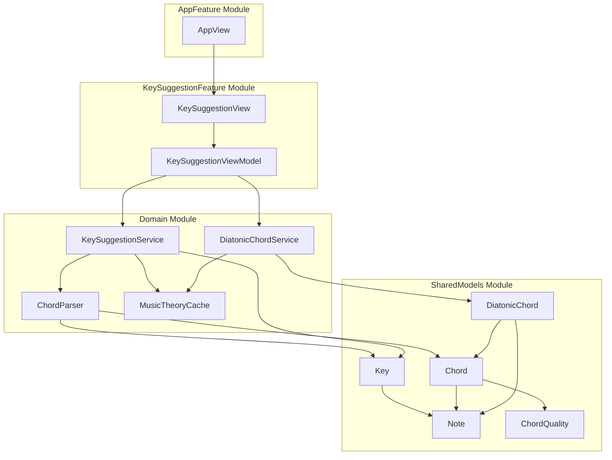
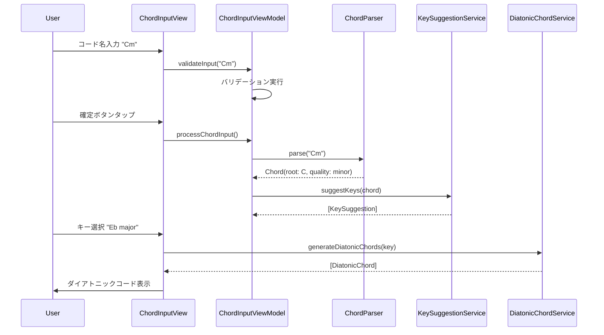

# 技術設計書

## 概要
音楽理論学習補助iOSアプリの技術設計。SwiftUIベースのネイティブアプリとして、コード名解析、キーサジェスト、ダイアトニックコード表示機能を提供する。オフライン動作を前提とし、高速かつ正確な音楽理論計算を実現する。

## アーキテクチャ

### マルチモジュール構成



### 依存関係

```
AppFeature → KeySuggestionFeature → Domain → SharedModels
                                 ↗
                      SharedModels
```

## 技術スタック
- **フレームワーク**: SwiftUI (iOS 17.0+)
- **言語**: Swift 6.0+
- **アーキテクチャパターン**: MVVM (Model-View-ViewModel)
- **状態管理**: Observationフレームワーク
- **データ永続化**: UserDefaults
- **依存性注入**: Swift標準のDI Container
- **テスト**: Swift Testing
- **ビルドシステム**: Xcode Workspace + Swift Package Manager
- **モジュール構成**: マルチモジュール（AppFeature, KeySuggestionFeature, Domain, SharedModels）

## コンポーネント設計

### 1. UI層 (SwiftUI Views)

#### AppView（AppFeatureモジュール）
```swift
// AppFeature/AppView.swift
import SwiftUI
import KeySuggestionFeature

public struct AppView: View {
    public var body: some View {
        KeySuggestionView()
    }
    
    public init() {}
}
```

#### KeySuggestionView（KeySuggestionFeatureモジュール）
```swift
// KeySuggestionFeature/KeySuggestionView.swift
import SwiftUI
import Domain
import SharedModels

public struct KeySuggestionView: View {
    @State private var viewModel = KeySuggestionViewModel()
    @FocusState private var isTextFieldFocused: Bool
    
    public var body: some View {
        NavigationStack {
            VStack(spacing: 20) {
                // コード入力セクション
                VStack(alignment: .leading, spacing: 8) {
                    Text("コード名を入力")
                        .font(.headline)
                    
                    TextField("例: C, Am, F7, Bm7b5", text: $viewModel.chordInput)
                        .textFieldStyle(.roundedBorder)
                        .focused($isTextFieldFocused)
                        .onSubmit {
                            viewModel.processChordInput()
                        }
                        .onChange(of: viewModel.chordInput) { _, newValue in
                            viewModel.validateInput(newValue)
                        }
                    
                    if let errorMessage = viewModel.errorMessage {
                        Text(errorMessage)
                            .foregroundColor(.red)
                            .font(.caption)
                    }
                }
                
                // キーサジェストセクション
                if !viewModel.suggestedKeys.isEmpty {
                    KeySuggestionsView(suggestions: viewModel.suggestedKeys) { key in
                        viewModel.selectKey(key)
                    }
                }
                
                // ダイアトニックコード表示セクション
                if !viewModel.diatonicChords.isEmpty {
                    DiatonicChordsView(chords: viewModel.diatonicChords)
                }
                
                Spacer()
            }
            .padding()
            .navigationTitle("ダイアトニックコード")
        }
    }
    
    public init() {}
}
```

### 2. ViewModel層

#### KeySuggestionViewModel（KeySuggestionFeatureモジュール）
```swift
// KeySuggestionFeature/KeySuggestionViewModel.swift
import Observation
import Domain
import SharedModels

@Observable
class KeySuggestionViewModel {
    var chordInput: String = ""
    var errorMessage: String?
    var suggestedKeys: [KeySuggestion] = []
    var diatonicChords: [DiatonicChord] = []
    var selectedKey: Key?
    
    private let keySuggestionService: KeySuggestionService
    private let chordParser: ChordParserProtocol
    
    init(keySuggestionService: KeySuggestionService = KeySuggestionService(),
         chordParser: ChordParserProtocol = ChordParser()) {
        self.keySuggestionService = keySuggestionService
        self.chordParser = chordParser
    }
    
    func validateInput(_ input: String) {
        // リアルタイムバリデーション
        if input.isEmpty {
            errorMessage = nil
            suggestedKeys = []
            return
        }
        
        // 簡単なバリデーション
        let validPattern = "^[A-G][#b]?[^/]*((/[A-G][#b]?)?)$"
        let regex = try? NSRegularExpression(pattern: validPattern)
        let range = NSRange(location: 0, length: input.utf16.count)
        
        if regex?.firstMatch(in: input, range: range) == nil {
            errorMessage = "正しいコード記法で入力してください（例: C, Am, F7）"
        } else {
            errorMessage = nil
        }
    }
    
    func processChordInput() {
        guard errorMessage == nil, !chordInput.isEmpty else { return }
        
        do {
            let chord = try chordParser.parse(chordInput)
            suggestedKeys = keySuggestionService.suggestKeys(for: chord)
        } catch {
            errorMessage = "コード解析エラー: \(error.localizedDescription)"
            suggestedKeys = []
        }
    }
    
    func selectKey(_ key: Key) {
        selectedKey = key
        diatonicChords = key.diatonicChords
    }
}
```

### 3. Core Music Theory Engine

### SharedModelsモジュール

#### Chord Data Model
```swift
// SharedModels/Chord.swift
struct Chord: Equatable, Hashable {
    let root: Note
    let quality: ChordQuality
    let extensions: [ChordExtension]
    let bass: Note?
    
    var symbol: String {
        var result = root.name
        result += quality.symbol
        result += extensions.map(\.symbol).joined()
        if let bass = bass, bass != root {
            result += "/\(bass.name)"
        }
        return result
    }
}

// SharedModels/Note.swift
enum Note: String, CaseIterable {
    case c = "C"
    case cSharp = "C#"
    case d = "D"
    case dSharp = "D#"
    case e = "E"
    case f = "F"
    case fSharp = "F#"
    case g = "G"
    case gSharp = "G#"
    case a = "A"
    case aSharp = "A#"
    case b = "B"
    
    var name: String { rawValue }
    var semitoneValue: Int {
        switch self {
        case .c: return 0
        case .cSharp: return 1
        case .d: return 2
        case .dSharp: return 3
        case .e: return 4
        case .f: return 5
        case .fSharp: return 6
        case .g: return 7
        case .gSharp: return 8
        case .a: return 9
        case .aSharp: return 10
        case .b: return 11
        }
    }
}

// SharedModels/ChordQuality.swift
enum ChordQuality {
    case major
    case minor
    case diminished
    case augmented
    case dominant7
    case major7
    case minor7
    case sus2
    case sus4
    
    var symbol: String {
        switch self {
        case .major: return ""
        case .minor: return "m"
        case .diminished: return "dim"
        case .augmented: return "aug"
        case .dominant7: return "7"
        case .major7: return "maj7"
        case .minor7: return "m7"
        case .sus2: return "sus2"
        case .sus4: return "sus4"
        }
    }
}
```

#### Key Data Model
```swift
// SharedModels/Key.swift
struct Key: Equatable, Hashable {
    let tonic: Note
    let mode: KeyMode
    
    var name: String {
        return "\(tonic.name)\(mode.symbol)"
    }
    
    var diatonicChords: [DiatonicChord] {
        DiatonicChordService.generateDiatonicChords(for: self)
    }
}

enum KeyMode {
    case major
    case minor
    
    var symbol: String {
        switch self {
        case .major: return ""
        case .minor: return "m"
        }
    }
}

struct DiatonicChord {
    let degree: ScaleDegree
    let chord: Chord
    let function: HarmonicFunction
    let romanNumeral: String
}

enum ScaleDegree: Int, CaseIterable {
    case i = 1, ii, iii, iv, v, vi, vii
    
    var romanNumeral: String {
        switch self {
        case .i: return "I"
        case .ii: return "ii"
        case .iii: return "iii"
        case .iv: return "IV"
        case .v: return "V"
        case .vi: return "vi"
        case .vii: return "vii°"
        }
    }
}

enum HarmonicFunction {
    case tonic
    case subdominant
    case dominant
    
    var description: String {
        switch self {
        case .tonic: return "トニック"
        case .subdominant: return "サブドミナント"
        case .dominant: return "ドミナント"
        }
    }
}
```

### 4. Service層

### Domainモジュール

#### ChordParser
```swift
// Domain/Services/ChordParser.swift
protocol ChordParserProtocol {
    func parse(_ input: String) throws -> Chord
}

class ChordParser: ChordParserProtocol {
    private let notePattern = "([A-G][#b]?)"
    private let qualityPattern = "(m|maj|dim|aug|sus[24]?)?"
    private let extensionPattern = "([0-9]+)?"
    private let bassPattern = "(/([A-G][#b]?))?"
    
    func parse(_ input: String) throws -> Chord {
        let trimmed = input.trimmingCharacters(in: .whitespaces)
        let pattern = "^\(notePattern)\(qualityPattern)\(extensionPattern)\(bassPattern)$"
        
        guard let regex = try? NSRegularExpression(pattern: pattern, options: .caseInsensitive),
              let match = regex.firstMatch(in: trimmed, options: [], range: NSRange(trimmed.startIndex..., in: trimmed)) else {
            throw ChordParsingError.invalidFormat
        }
        
        let root = try parseNote(from: trimmed, match: match, groupIndex: 1)
        let quality = parseQuality(from: trimmed, match: match, groupIndex: 2)
        let extensions = parseExtensions(from: trimmed, match: match, groupIndex: 3)
        let bass = try parseNote(from: trimmed, match: match, groupIndex: 5, optional: true)
        
        return Chord(root: root, quality: quality, extensions: extensions, bass: bass)
    }
}

enum ChordParsingError: LocalizedError {
    case invalidFormat
    case unknownNote
    case unknownQuality
    
    var errorDescription: String? {
        switch self {
        case .invalidFormat:
            return "コード記法が正しくありません"
        case .unknownNote:
            return "認識できない音名です"
        case .unknownQuality:
            return "認識できないコード品質です"
        }
    }
}
```

#### KeySuggestionService
```swift
// Domain/Services/KeySuggestionService.swift
class KeySuggestionService {
    static func suggestKeys(for chord: Chord) -> [KeySuggestion] {
        var suggestions: [KeySuggestion] = []
        
        // 全キーに対してチェック
        for tonic in Note.allCases {
            for mode in [KeyMode.major, KeyMode.minor] {
                let key = Key(tonic: tonic, mode: mode)
                
                if let suggestion = checkChordInKey(chord: chord, key: key) {
                    suggestions.append(suggestion)
                }
            }
        }
        
        // 理論的重要度とよく使われる度合いでソート
        return suggestions.sorted { $0.score > $1.score }
    }
    
    private static func checkChordInKey(chord: Chord, key: Key) -> KeySuggestion? {
        let diatonicChords = key.diatonicChords
        
        // 完全一致チェック
        if let matchedChord = diatonicChords.first(where: { $0.chord == chord }) {
            return KeySuggestion(
                key: key,
                reason: "\(matchedChord.romanNumeral)コードとして含まれます",
                score: calculateScore(for: key, chordDegree: matchedChord.degree, matchType: .exact)
            )
        }
        
        // 部分一致チェック（三和音ベース）
        let simpleChord = Chord(root: chord.root, quality: chord.quality, extensions: [], bass: nil)
        if let matchedChord = diatonicChords.first(where: { $0.chord.root == simpleChord.root && $0.chord.quality == simpleChord.quality }) {
            return KeySuggestion(
                key: key,
                reason: "\(matchedChord.romanNumeral)コード（\(chord.symbol)は拡張形）として含まれます",
                score: calculateScore(for: key, chordDegree: matchedChord.degree, matchType: .partial)
            )
        }
        
        return nil
    }
    
    private static func calculateScore(for key: Key, chordDegree: ScaleDegree, matchType: MatchType) -> Double {
        var score: Double = 0
        
        // 基本スコア
        score += matchType == .exact ? 10 : 7
        
        // コード機能による重み付け
        switch chordDegree {
        case .i, .iv, .v: score += 3  // 主要三和音
        case .ii, .vi: score += 2     // 準主要三和音
        case .iii, .vii: score += 1   // その他
        }
        
        // キーの使用頻度による重み付け
        score += keyUsageWeight(for: key)
        
        return score
    }
}

struct KeySuggestion {
    let key: Key
    let reason: String
    let score: Double
}

enum MatchType {
    case exact
    case partial
}
```

#### DiatonicChordService
```swift
// Domain/Services/DiatonicChordService.swift
class DiatonicChordService {
    static func generateDiatonicChords(for key: Key) -> [DiatonicChord] {
        let scale = generateScale(for: key)
        var diatonicChords: [DiatonicChord] = []
        
        for (index, degree) in ScaleDegree.allCases.enumerated() {
            let chord = buildTriad(fromScale: scale, degree: index)
            let function = harmonicFunction(for: degree, in: key.mode)
            let romanNumeral = romanNumeralForDegree(degree, in: key.mode, chord: chord)
            
            diatonicChords.append(DiatonicChord(
                degree: degree,
                chord: chord,
                function: function,
                romanNumeral: romanNumeral
            ))
        }
        
        return diatonicChords
    }
    
    private static func generateScale(for key: Key) -> [Note] {
        let intervals: [Int]
        
        switch key.mode {
        case .major:
            intervals = [0, 2, 4, 5, 7, 9, 11]  // メジャースケール
        case .minor:
            intervals = [0, 2, 3, 5, 7, 8, 10]  // ナチュラルマイナースケール
        }
        
        return intervals.map { interval in
            let semitone = (key.tonic.semitoneValue + interval) % 12
            return Note.allCases.first { $0.semitoneValue == semitone }!
        }
    }
    
    private static func buildTriad(fromScale scale: [Note], degree: Int) -> Chord {
        let root = scale[degree]
        let third = scale[(degree + 2) % 7]
        let fifth = scale[(degree + 4) % 7]
        
        let quality = determineChordQuality(root: root, third: third, fifth: fifth)
        
        return Chord(root: root, quality: quality, extensions: [], bass: nil)
    }
    
    private static func harmonicFunction(for degree: ScaleDegree, in mode: KeyMode) -> HarmonicFunction {
        switch (degree, mode) {
        case (.i, _), (.iii, .major), (.vi, .major):
            return .tonic
        case (.ii, _), (.iv, _):
            return .subdominant
        case (.v, _), (.vii, _):
            return .dominant
        default:
            return .tonic  // デフォルト
        }
    }
}
```

## データフロー



## エラーハンドリング

### ChordInputError
```swift
enum ChordInputError: LocalizedError {
    case emptyInput
    case invalidChordFormat
    case unsupportedChordType
    case parsingFailed(String)
    
    var errorDescription: String? {
        switch self {
        case .emptyInput:
            return "コード名を入力してください"
        case .invalidChordFormat:
            return "正しいコード記法で入力してください（例: C, Am, F7）"
        case .unsupportedChordType:
            return "このコードタイプは現在サポートされていません"
        case .parsingFailed(let detail):
            return "コード解析に失敗しました: \(detail)"
        }
    }
    
    var suggestions: [String] {
        switch self {
        case .invalidChordFormat:
            return ["C", "Am", "F7", "Bm7b5", "Csus4"]
        default:
            return []
        }
    }
}
```

## セキュリティ考慮事項

### 入力検証
- コード名入力の文字数制限（最大20文字）
- 正規表現による入力形式の厳密な検証
- SQLインジェクション対策（Core Data使用のため基本的に安全）

### データ保護
- ユーザー設定のみローカル保存
- 機密情報の保存なし
- アプリサンドボックス内でのデータ保護

## パフォーマンス最適化

### 計算最適化
```swift
class MusicTheoryCache {
    private static var keyToChordCache: [Key: [DiatonicChord]] = [:]
    private static var chordToKeyCache: [Chord: [KeySuggestion]] = [:]
    
    static func getCachedDiatonicChords(for key: Key) -> [DiatonicChord] {
        if let cached = keyToChordCache[key] {
            return cached
        }
        
        let chords = DiatonicChordService.generateDiatonicChords(for: key)
        keyToChordCache[key] = chords
        return chords
    }
    
    static func getCachedKeySuggestions(for chord: Chord) -> [KeySuggestion] {
        if let cached = chordToKeyCache[chord] {
            return cached
        }
        
        let suggestions = KeySuggestionService.suggestKeys(for: chord)
        chordToKeyCache[chord] = suggestions
        return suggestions
    }
}
```

### UI最適化
- LazyVStackを使用したリスト描画の最適化
- Observationフレームワークによる適切な状態管理
- Swift Concurrencyによる非同期処理の最適化

## テスト戦略

### 単体テスト
```swift
import Testing

struct ChordParserTests {
    let parser = ChordParser()
    
    @Test
    func basicChordParsing() throws {
        let chord = try parser.parse("C")
        #expect(chord.root == .c)
        #expect(chord.quality == .major)
    }
    
    @Test
    func minorChordParsing() throws {
        let chord = try parser.parse("Am")
        #expect(chord.root == .a)
        #expect(chord.quality == .minor)
    }
    
    @Test
    func seventhChordParsing() throws {
        let chord = try parser.parse("G7")
        #expect(chord.root == .g)
        #expect(chord.quality == .dominant7)
    }
}

struct KeySuggestionServiceTests {
    @Test
    func cMajorChordSuggestion() {
        let chord = Chord(root: .c, quality: .major, extensions: [], bass: nil)
        let suggestions = KeySuggestionService.suggestKeys(for: chord)
        
        #expect(suggestions.contains { $0.key == Key(tonic: .c, mode: .major) })
        #expect(suggestions.contains { $0.key == Key(tonic: .f, mode: .major) })
        #expect(suggestions.contains { $0.key == Key(tonic: .g, mode: .major) })
    }
}
```

## iOS固有実装

### 状態保存
```swift
import Observation

@Observable
class AppStateManager {
    var lastInputChord: String = ""
    var selectedKey: Key?
    
    private let userDefaults = UserDefaults.standard
    
    init() {
        loadState()
    }
    
    func saveState() {
        userDefaults.set(lastInputChord, forKey: "lastInputChord")
        if let selectedKey = selectedKey {
            userDefaults.set(selectedKey.name, forKey: "selectedKey")
        }
    }
    
    private func loadState() {
        lastInputChord = userDefaults.string(forKey: "lastInputChord") ?? ""
        if let keyName = userDefaults.string(forKey: "selectedKey") {
            selectedKey = parseKeyFromName(keyName)
        }
    }
}
```