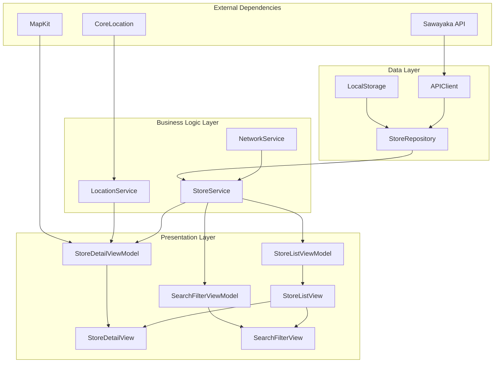

# Technical Design

## Overview
静岡県のファミレスチェーン「さわやか」の待ち時間確認iOSアプリケーションの技術設計。MVVM+Repository パターンを採用し、SwiftUIとSwift Concurrencyを活用したモダンなiOSアプリとして構築する。iOS17.0以降をサポートし、単一ターゲットの構成とする。

## Architecture



## Technology Stack
- **UI Framework**: SwiftUI (iOS 17.0+)
- **Architecture**: MVVM + Repository Pattern
- **Async Programming**: Swift Concurrency (async/await, Task, Actor)
- **Navigation**: NavigationStack (iOS 16+)
- **Networking**: URLSession with Swift Concurrency
- **Local Storage**: UserDefaults (設定情報), FileManager (キャッシュ)
- **Location**: CoreLocation
- **Map**: MapKit
- **State Management**: Observation Framework (iOS 17+)
- **Testing**: Swift Testing
- **Package Manager**: Swift Package Manager

## Components and Interfaces

### ViewModels
```swift
@MainActor
@Observable
class StoreListViewModel {
    var stores: [Store] = []
    var isLoading: Bool = false
    var lastUpdated: Date?
    var errorMessage: String?
    
    private let storeService: StoreServiceProtocol
    
    init(storeService: StoreServiceProtocol) {
        self.storeService = storeService
    }
    
    func refreshStores() async
    func filterStores(by criteria: FilterCriteria)
    func searchStores(query: String)
}

@MainActor
@Observable
class StoreDetailViewModel {
    var store: Store?
    var isLoading: Bool = false
    
    private let storeService: StoreServiceProtocol
    
    init(storeService: StoreServiceProtocol) {
        self.storeService = storeService
    }
    
    func loadStoreDetail(id: String) async
    func makePhoneCall(phoneNumber: String)
    func openInMaps(coordinate: CLLocationCoordinate2D)
}
```

### Services
```swift
protocol StoreServiceProtocol {
    func fetchStores() async throws -> [Store]
    func fetchStoreDetail(id: String) async throws -> Store
}

actor StoreService: StoreServiceProtocol {
    private let repository: StoreRepositoryProtocol
    private let cacheService: CacheServiceProtocol
    
    func fetchStores() async throws -> [Store]
    func fetchStoreDetail(id: String) async throws -> Store
}
```

### Repository
```swift
protocol StoreRepositoryProtocol {
    func getStores() async throws -> [Store]
    func getStore(by id: String) async throws -> Store
}

class StoreRepository: StoreRepositoryProtocol {
    private let apiClient: APIClientProtocol
    private let localStorage: LocalStorageProtocol
    
    func getStores() async throws -> [Store]
    func getStore(by id: String) async throws -> Store
}
```

### Data Flow
1. **初期表示**: View → ViewModel → Service → Repository → APIClient → API
2. **プルリフレッシュ**: SwiftUI RefreshableModifier → ViewModel.refreshStores() → Service → Repository
3. **検索・フィルタ**: SearchBar Input → ViewModel.searchStores() → ローカルフィルタリング
4. **詳細表示**: NavigationLink → StoreDetailView → StoreDetailViewModel → Service

## Data Models

```swift
/// さわやか店舗の情報を表現するモデル
struct Store: Identifiable, Decodable, Sendable, Equatable {
    /// 店舗の一意識別子
    let id: String
    /// 店舗名（例: "さわやか 静岡インター店"）
    let name: String
    /// 店舗住所
    let address: String
    /// 店舗電話番号（ハイフンあり形式）
    let phoneNumber: String
    /// 店舗の座標情報
    let coordinate: Coordinate
    /// 営業時間情報
    let businessHours: BusinessHours
    /// 現在の待ち時間情報（変更可能）
    var waitTime: WaitTime
    /// 地域区分（例: "静岡市", "浜松市"）
    let region: String
}

/// 店舗の待ち時間情報
struct WaitTime: Decodable, Sendable, Equatable {
    /// 待ち時間（分）。営業時間外や取得不可の場合はnil
    let minutes: Int?
    /// 待ち時間のステータス
    let status: WaitStatus
    /// 最終更新日時
    let lastUpdated: Date
    
    /// 待ち時間の状態を表すEnum
    enum WaitStatus: String, Decodable, Sendable, CaseIterable, Equatable {
        case available = "available"      // 営業中
        case closed = "closed"           // 営業時間外
        case unavailable = "unavailable" // データ取得不可
    }
    
    /// 待ち時間に応じた表示色を取得
    var colorCode: Color {
        switch status {
        case .available:
            guard let minutes = minutes else { return .gray }
            if minutes <= 30 { return .green }
            else if minutes <= 60 { return .yellow }
            else { return .red }
        case .closed, .unavailable:
            return .gray
        }
    }
}

/// 店舗の営業時間情報
struct BusinessHours: Decodable, Sendable, Equatable {
    /// 平日営業時間（例: "11:00-23:00"）
    let weekday: String
    /// 週末営業時間（例: "11:00-23:00"）
    let weekend: String
    /// 祝日営業時間（例: "11:00-22:00"）。祝日営業していない場合はnil
    let holiday: String?
}

/// 地理座標情報
struct Coordinate: Decodable, Sendable, Equatable {
    /// 緯度
    let latitude: Double
    /// 経度
    let longitude: Double
    
    /// CoreLocationのCLLocationCoordinate2Dに変換
    var clLocationCoordinate2D: CLLocationCoordinate2D {
        CLLocationCoordinate2D(latitude: latitude, longitude: longitude)
    }
}

/// 店舗検索・フィルタリング用の条件
struct FilterCriteria: Sendable, Equatable {
    /// 最大待ち時間（分）。指定した時間以下の店舗のみ表示
    var maxWaitTime: Int? = nil
    /// 営業中の店舗のみ表示するかどうか
    var openOnly: Bool = false
    /// 地域フィルター（例: "静岡市"）
    var region: String? = nil
    /// 検索クエリ（店舗名での部分一致検索）
    var searchQuery: String = ""
}
```

### API Endpoints
```
GET /api/stores
Response: [Store]

GET /api/stores/:id  
Response: Store

GET /api/stores/:id/waittime
Response: WaitTime
```

## Error Handling

### Error Types
```swift
enum APIError: LocalizedError {
    case networkUnavailable
    case invalidResponse
    case serverError(Int)
    case decodingError
    case timeout
    
    var errorDescription: String? {
        switch self {
        case .networkUnavailable:
            return "ネットワーク接続を確認してください"
        case .invalidResponse:
            return "サーバーからの応答が無効です"
        case .serverError(let code):
            return "サーバーエラー (コード: \(code))"
        case .decodingError:
            return "データの解析に失敗しました"
        case .timeout:
            return "リクエストがタイムアウトしました"
        }
    }
}
```

### Error Handling Strategy
- **ネットワークエラー**: リトライボタン付きエラー表示
- **データ解析エラー**: ログ出力 + 汎用エラーメッセージ
- **タイムアウト**: 自動リトライ（最大3回）+ ユーザー通知
- **サーバーエラー**: エラーコード表示 + サポート連絡先

## Security Considerations

### データ保護
- **API通信**: HTTPS必須、Certificate Pinning推奨
- **ローカルストレージ**: 機密情報の平文保存禁止
- **ログ出力**: 本番環境では個人情報のログ出力無効化

### プライバシー
- **位置情報**: 使用時のみ許可要求、目的明示
- **ネットワーク**: 最小限のデータ送信
- **Analytics**: 個人識別情報除外

## Performance & Scalability

### パフォーマンス最適化
- **画像読み込み**: AsyncImage + 適切なサイズ調整
- **リスト表示**: LazyVStack使用、セル再利用最適化  
- **メモリ管理**: Task cancellation、適切なRetain Cycle回避
- **キャッシュ戦略**: 店舗情報のローカルキャッシュ（24時間有効）

### ネットワーク最適化
```swift
// URLSessionの設定例
private func configureURLSession() -> URLSession {
    let config = URLSessionConfiguration.default
    config.requestCachePolicy = .reloadIgnoringLocalCacheData
    config.timeoutIntervalForRequest = 30.0
    config.timeoutIntervalForResource = 60.0
    return URLSession(configuration: config)
}
```

## Testing Strategy

### Unit Testing
```swift
// ViewModelテスト例（Swift Testing使用）
@MainActor
@Test
func refreshStores_Success() async throws {
    // Given
    let mockService = MockStoreService()
    let viewModel = StoreListViewModel(storeService: mockService)
    
    // When
    await viewModel.refreshStores()
    
    // Then
    #expect(!viewModel.stores.isEmpty)
    #expect(viewModel.errorMessage == nil)
}

// データモデルテスト例
@Test
func waitTime_ColorCode_ReturnsCorrectColor() {
    // Given
    let shortWaitTime = WaitTime(minutes: 20, status: .available, lastUpdated: Date())
    let longWaitTime = WaitTime(minutes: 70, status: .available, lastUpdated: Date())
    let closedWaitTime = WaitTime(minutes: nil, status: .closed, lastUpdated: Date())
    
    // Then
    #expect(shortWaitTime.colorCode == .green)
    #expect(longWaitTime.colorCode == .red)
    #expect(closedWaitTime.colorCode == .gray)
}
```

### Integration Testing
- **Repository層**: APIClient + LocalStorage統合テスト
- **Service層**: Repository + NetworkService統合テスト
- **ViewModel層**: Service + View統合テスト

### テスト環境
- **Mock Server**: 開発時のAPI代替
- **Test Data**: 静岡県内の実店舗データを模した固定データ
- **CI/CD**: GitHub Actionsでの自動テスト実行
